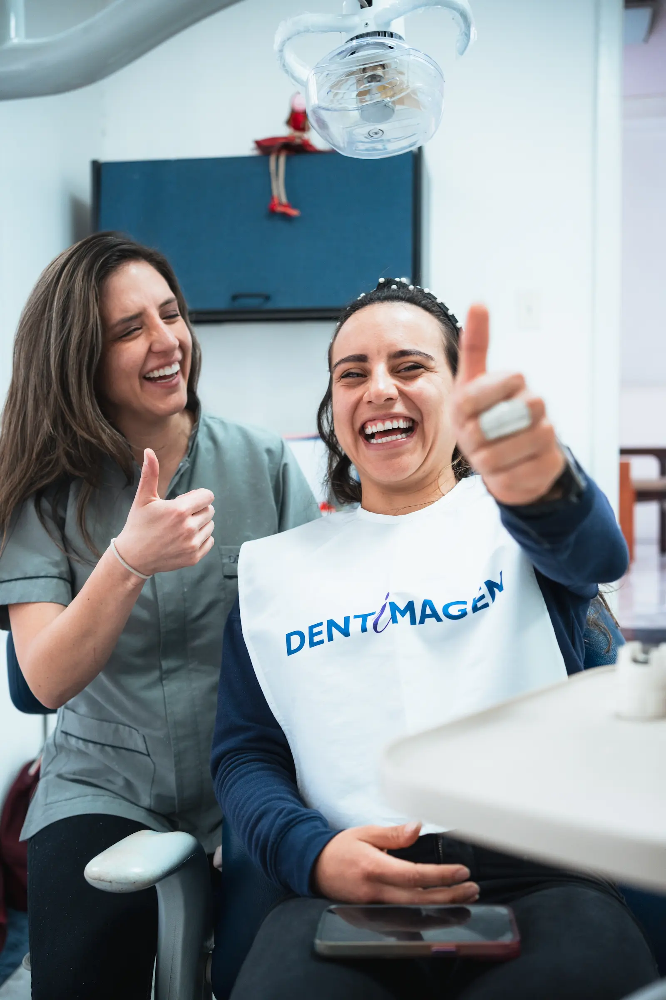

# Inventario Final de Fotos y Social Sharing — Dentimagen

> Rama activa sugerida: `feature/final-assets-and-sharing`
> Última actualización: 15 de abril de 2026

Este documento ya no es solo una guía genérica: ahora funciona como **inventario real por página** para saber:

- qué fotos ya están cargadas
- cuáles todavía faltan
- qué fotos hoy están repetidas
- qué nombre exacto debe usar cada archivo
- qué formato, dimensión y peso conviene exportar

## 1. Resumen rápido del estado actual

### Slots de imagen definidos en el sitio

- Home: `6`
- Sede Norte: `10`
- Sede Cumbayá: `10`
- Social sharing (`og:image`): `1`

Total de slots visuales principales: `27`

### Estado actual

- Slots ya cubiertos con archivo existente: `13`
- Slots aún faltantes: `14`
- `og:image`: pendiente

### Fotos actualmente cargadas en `website/assets/photos/`

- `home-hero-clinica-01.webp`
- `home-hero-equipo-02.webp`
- `home-hero-recepcion-03.webp`
- `home-why-ambiente-03.webp`
- `home-why-equipo-01.webp`
- `sede-cumbaya-ambiente-01.webp`
- `sede-cumbaya-equipo-02.webp`
- `sede-cumbaya-galeria-01.webp`
- `sede-cumbaya-galeria-04.webp`
- `sede-norte-galeria-01.webp`
- `sede-norte-galeria-02.webp`
- `sede-norte-recepcion-01.webp`
- `sede-norte-tecnologia-03.webp`

## 2. Convención general de exportación

### Formato recomendado

- Fotos: `WebP`
- `og:image`: `JPG` o `WebP`
- Iconos lineart: `PNG` transparente

### Reglas prácticas

- No subas los originales pesados directamente al sitio.
- Conserva los originales aparte y exporta una copia optimizada para web.
- El sitio usa `object-fit: cover`, así que prioriza encuadres limpios y sin demasiado detalle en los bordes.

### Guía base por tipo de bloque

| Tipo de bloque | Formato | Dimensión recomendada | Peso ideal |
|---|---|---:|---:|
| Hero home | `WebP` | `1600 x 2400 px` | `120–250 KB` |
| Carrusel “Por qué elegirnos” | `WebP` | `1600 x 2400 px` | `120–250 KB` |
| Carrusel de sedes | `WebP` | `1600 px` lado largo, ideal `1600 x 1067` o `1600 x 2400` según encuadre | `100–220 KB` |
| Galerías de sedes | `WebP` | `1200–1400 px` lado largo | `80–220 KB` |
| `og:image` | `JPG` o `WebP` | `1200 x 630 px` | `150–300 KB` |

## 3. Inventario por página

### Página: Home
Archivo: `website/index.html`

#### Hero principal

| Slot | Archivo | Estado actual | Archivo cargado hoy | Dimensión actual | Peso actual | Exportación recomendada | Nota |
|---|---|---|---|---:|---:|---:|---|
| Hero 1 | `home-hero-clinica-01.webp` | Cargada | Sí | `1600x2400` | `114 KB` | `1600x2400 WebP` | Buena como primera imagen |
| Hero 2 | `home-hero-equipo-02.webp` | Cargada | Sí | `1600x2400` | `191 KB` | `1600x2400 WebP` | Actualmente se repite con `home-why-equipo-01` |
| Hero 3 | `home-hero-recepcion-03.webp` | Cargada | Sí | `1600x2400` | `191 KB` | `1600x2400 WebP` | Actualmente se repite con `home-why-ambiente-03` |

#### Carrusel “Por qué elegirnos”

| Slot | Archivo | Estado actual | Archivo cargado hoy | Dimensión actual | Peso actual | Exportación recomendada | Nota |
|---|---|---|---|---:|---:|---:|---|
| Why 1 | `home-why-equipo-01.webp` | Cargada | Sí | `1600x2400` | `191 KB` | `1600x2400 WebP` | Buena |
| Why 2 | `home-why-tecnologia-02.webp` | Faltante | No | — | — | `1600x2400 WebP` | Prioridad alta |
| Why 3 | `home-why-ambiente-03.webp` | Cargada | Sí | `1600x2400` | `191 KB` | `1600x2400 WebP` | Actualmente se repite con `home-hero-recepcion-03` |

#### Lo que falta en Home

- `home-why-tecnologia-02.webp`

#### Repeticiones actuales en Home

- `home-hero-equipo-02.webp` y `home-why-equipo-01.webp` hoy muestran la misma foto
- `home-hero-recepcion-03.webp` y `home-why-ambiente-03.webp` hoy muestran la misma foto

### Página: Sede Norte
Archivo: `website/dentista-norte-quito.html`

#### Carrusel visual

| Slot | Archivo | Estado actual | Archivo cargado hoy | Dimensión actual | Peso actual | Exportación recomendada | Nota |
|---|---|---|---|---:|---:|---:|---|
| Norte 1 | `sede-norte-recepcion-01.webp` | Cargada | Sí | `1800x2700` | `92 KB` | `1600x2400 WebP` o `1600x1067 WebP` | Sirve, aunque es vertical |
| Norte 2 | `sede-norte-equipo-02.webp` | Faltante | No | — | — | `1600x2400 WebP` | Falta |
| Norte 3 | `sede-norte-tecnologia-03.webp` | Cargada | Sí | `1800x2700` | `92 KB` | `1600x2400 WebP` o `1600x1067 WebP` | Actualmente se repite con `sede-norte-galeria-02` |

#### Galería

| Slot | Archivo | Estado actual | Archivo cargado hoy | Dimensión actual | Peso actual | Exportación recomendada | Nota |
|---|---|---|---|---:|---:|---:|---|
| Galería 1 | `sede-norte-galeria-01.webp` | Cargada | Sí | `1800x2700` | `92 KB` | `1200–1400 px WebP` | Actualmente se repite con `sede-norte-recepcion-01` |
| Galería 2 | `sede-norte-galeria-02.webp` | Cargada | Sí | `1800x2700` | `92 KB` | `1200–1400 px WebP` | Buena |
| Galería 3 | `sede-norte-galeria-03.webp` | Faltante | No | — | — | `1200–1400 px WebP` | Falta |
| Galería 4 | `sede-norte-galeria-04.webp` | Faltante | No | — | — | `1200–1400 px WebP` | Falta |
| Galería 5 | `sede-norte-galeria-05.webp` | Faltante | No | — | — | `1200–1400 px WebP` | Falta |
| Galería 6 | `sede-norte-galeria-06.webp` | Faltante | No | — | — | `1200–1400 px WebP` | Falta |
| Galería 7 | `sede-norte-galeria-07.webp` | Faltante | No | — | — | `1200–1400 px WebP` | Falta |

#### Lo que falta en Sede Norte

- `sede-norte-equipo-02.webp`
- `sede-norte-galeria-03.webp`
- `sede-norte-galeria-04.webp`
- `sede-norte-galeria-05.webp`
- `sede-norte-galeria-06.webp`
- `sede-norte-galeria-07.webp`

#### Repeticiones actuales en Sede Norte

- `sede-norte-galeria-01.webp` y `sede-norte-recepcion-01.webp` hoy muestran la misma foto
- `sede-norte-tecnologia-03.webp` hoy reutiliza la misma toma que se usó para el consultorio de galería

### Página: Sede Cumbayá
Archivo: `website/dentista-cumbaya.html`

#### Carrusel visual

| Slot | Archivo | Estado actual | Archivo cargado hoy | Dimensión actual | Peso actual | Exportación recomendada | Nota |
|---|---|---|---|---:|---:|---:|---|
| Cumbayá 1 | `sede-cumbaya-ambiente-01.webp` | Cargada | Sí | `1600x1067` | `140 KB` | `1600x1067 WebP` | Muy buena |
| Cumbayá 2 | `sede-cumbaya-equipo-02.webp` | Cargada | Sí | `1600x1067` | `140 KB` | `1600x1067 WebP` | Actualmente se repite con `sede-cumbaya-galeria-04` |
| Cumbayá 3 | `sede-cumbaya-tecnologia-03.webp` | Faltante | No | — | — | `1600x1067 WebP` | Falta |

#### Galería

| Slot | Archivo | Estado actual | Archivo cargado hoy | Dimensión actual | Peso actual | Exportación recomendada | Nota |
|---|---|---|---|---:|---:|---:|---|
| Galería 1 | `sede-cumbaya-galeria-01.webp` | Cargada | Sí | `1600x1067` | `140 KB` | `1200–1400 px WebP` | Actualmente se repite con `sede-cumbaya-ambiente-01` |
| Galería 2 | `sede-cumbaya-galeria-02.webp` | Faltante | No | — | — | `1200–1400 px WebP` | Falta |
| Galería 3 | `sede-cumbaya-galeria-03.webp` | Faltante | No | — | — | `1200–1400 px WebP` | Falta |
| Galería 4 | `sede-cumbaya-galeria-04.webp` | Cargada | Sí | `1600x1067` | `140 KB` | `1200–1400 px WebP` | Buena |
| Galería 5 | `sede-cumbaya-galeria-05.webp` | Faltante | No | — | — | `1200–1400 px WebP` | Falta |
| Galería 6 | `sede-cumbaya-galeria-06.webp` | Faltante | No | — | — | `1200–1400 px WebP` | Falta |
| Galería 7 | `sede-cumbaya-galeria-07.webp` | Faltante | No | — | — | `1200–1400 px WebP` | Falta |

#### Lo que falta en Sede Cumbayá

- `sede-cumbaya-tecnologia-03.webp`
- `sede-cumbaya-galeria-02.webp`
- `sede-cumbaya-galeria-03.webp`
- `sede-cumbaya-galeria-05.webp`
- `sede-cumbaya-galeria-06.webp`
- `sede-cumbaya-galeria-07.webp`

#### Repeticiones actuales en Sede Cumbayá

- `sede-cumbaya-galeria-01.webp` y `sede-cumbaya-ambiente-01.webp` hoy muestran la misma foto
- `sede-cumbaya-equipo-02.webp` y `sede-cumbaya-galeria-04.webp` hoy muestran la misma foto

### Social sharing

#### `og:image`

| Uso | Archivo | Estado actual | Formato recomendado | Dimensión recomendada | Peso ideal | Nota |
|---|---|---|---|---:|---:|---|
| Preview social general | `website/assets/og/dentimagen-og-image.jpg` | Faltante | `JPG` o `WebP` | `1200x630` | `150–300 KB` | Prioridad alta antes de compartir/publicar |

## 4. Página sin fotos específicas todavía

Estas páginas hoy no dependen de fotos reales dedicadas más allá de logo y favicon:

- `website/implantes-dentales-quito.html`
- `website/ortodoncia-quito.html`
- `website/blanqueamiento-dental-quito.html`
- `website/diseno-de-sonrisa-quito.html`
- `website/implantes-cumbaya.html`
- `website/blog/index.html`
- artículos del blog

Eso significa que, por ahora, la prioridad fotográfica real del proyecto está en:

- home
- sede Norte
- sede Cumbayá
- `og:image`

## 5. Recursos de marca ya resueltos

### Logo

- `website/assets/logo-dentimagen.png`

### Favicon

- `website/assets/favicon/dentimagen-favicon-op1.ico`
- `website/assets/favicon/dentimagen-favicon-op1.png`

### Iconos de servicios

- `website/assets/icons/implantes.png`
- `website/assets/icons/ortodoncia.png`
- `website/assets/icons/blanqueamiento.png`

Si esos PNG todavía no están subidos, el sitio usa fallback visual.

## 6. Cómo editar el crop o posición después

Sí, **es fácil ajustarlo luego**. No siempre hace falta volver a exportar la foto.

### Cómo funciona hoy

Las imágenes usan principalmente:

- `object-fit: cover`

Eso hace que la foto llene el bloque visual, pero recortando lo que sobra.

### Qué se puede ajustar después

Lo más común es cambiar:

- `object-position: center center;`
- `object-position: center top;`
- `object-position: 50% 30%;`

### ¿Eso se cambia en HTML o CSS?

Se puede hacer de las dos maneras:

#### Opción rápida

En HTML, por imagen:

```html

```

#### Opción más limpia

Con clases CSS:

```css
.crop-top { object-position: center top; }
.crop-face { object-position: 50% 25%; }
```

```html

```

### Recomendación práctica

- Si solo son 1 o 2 ajustes: HTML está bien
- Si vas a afinar muchas fotos: mejor hacerlo con clases CSS

No necesitas rehacer toda la página para eso. Es un ajuste pequeño y normal en este tipo de sitio.

## 7. Orden recomendado desde este punto

1. Completar las fotos faltantes del home
2. Completar las faltantes de sede Norte
3. Completar las faltantes de sede Cumbayá
4. Crear `og:image`
5. Hacer una pasada visual de crop/encuadre
6. Recién después cerrar esta branch y seguir con QA final / publicación
